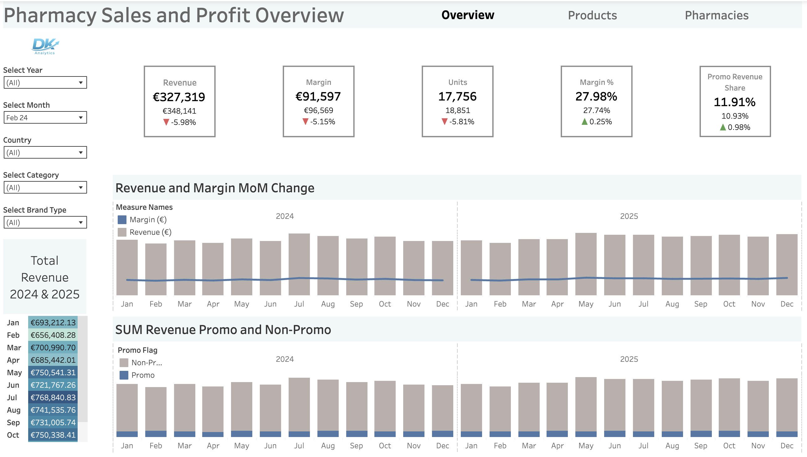

# 💊 Pharmacy Sales, Margin & Promotion Performance Analysis
**SQL + Tableau Analytics Project**

This project analyzes **pharmacy sales performance, profitability, and promotional effectiveness** across products, pharmacies, geography, and time.  
The objective is to uncover **what is truly driving growth, margin, and operational efficiency** — and where performance is being diluted.

---

## 📌 Executive Summary

This analysis reviews pharmacy sales performance from 2024–2025 to assess growth, profitability, and promotional effectiveness across products, pharmacies, and regions.

Revenue and margin grow steadily over the two-year period, remaining closely aligned month over month, which indicates stable pricing discipline and sustainable growth. Clear seasonality is present, with peak performance between May and October and the strongest MoM growth occurring in late spring and summer.

Revenue is not overly concentrated in a small number of products or pharmacies. While top pharmacies generate higher revenue through scale, margin percentages remain consistent across locations, suggesting performance differences are driven by demand rather than operational efficiency. Branded products similarly drive profit primarily through volume, not higher margins.

Promotions contribute a limited share of total revenue and consistently reduce margin without generating sufficient volume uplift, indicating that current discounting strategies are under-optimized and pose a profitability risk.

Overall, the greatest opportunities lie in scaling high-margin categories, leveraging seasonal demand more effectively, and refining promotion strategies to improve margin outcomes.

---

**Dashboard Preview**

🔗 **Interactive Tableau Dashboard:**  
[https://public.tableau.com/app/profile/dmitry.kuvyrdin/viz/PharmacySalesandProfitability/DBMain](https://public.tableau.com/app/profile/dmitry.kuvyrdin/viz/PharmacySalesandProfitability/DBMain)

---

## 📌 Project Overview

This analysis evaluates **two years of pharmacy transaction data (2024–2025)** to understand how revenue, margin, and units sold evolve across:

- Time
- Products and categories
- Pharmacies and geography
- Promotional vs non-promotional activity

The project mirrors a **real-world analytics workflow**, progressing from:
**high-level KPIs → diagnostic analysis → actionable insights**.

---

## 🎯 Core Objectives

- Track revenue, margin, and unit growth over time
- Identify seasonal demand patterns
- Measure scale vs efficiency at pharmacy level
- Compare branded vs generic product performance
- Quantify promotion effectiveness and margin tradeoffs
- Enable drill-down from overall performance to local drivers

---

## 🗂 Dataset Description

The dataset consists of transactional pharmacy sales joined to product, pharmacy, and date dimensions.

### Fact Table
- `pharmacy_data`
  - Units sold
  - Revenue (€)
  - Margin (€)
  - Promotion flag
  - Transaction date
  - Product ID
  - Pharmacy ID

### Dimension Tables
- `dim_date` – calendar attributes (year, month, month name)
- `dim_product` – product name, category, branded vs generic
- `dim_pharmacy` – pharmacy name and geographic attributes

### Dataset Scope
- Date range: **January 2024 – December 2025**
- ~120 pharmacies
- ~220 products
- Promo and non-promo transactions

---

## 🧾 SQL Queries

📂 **SQL Queries:**  
Queries are organized to reflect a structured analytical workflow from data preparation to insight generation.

* [`0_snake_case.sql`](./sql/0_snake_case.sql)  
  Column standardization and naming consistency.  
  Converts raw column names into snake_case to improve SQL readability and Tableau compatibility.

* [`1_explore.sql`](./sql/1_explore.sql)  
  Initial data exploration and validation.  
  Validates row counts, date coverage, revenue totals, and distribution sanity checks.

* [`2_time.sql`](./sql/2_time.sql)  
  Time-based performance analysis.  
  Computes monthly revenue, margin, units, and MoM growth to surface trends and seasonality.

* [`3_product_performance.sql`](./sql/3_product_performance.sql)  
  Product and category performance analysis.  
  Identifies top products, revenue concentration, category margins, and branded vs generic dynamics.

* [`4_geographic.sql`](./sql/4_geographic.sql)  
  Pharmacy and geographic performance analysis.  
  Compares scale vs efficiency across pharmacies and supports geographic visualization.

* [`5_promos.sql`](./sql/5_promos.sql)  
  Promotion effectiveness analysis.  
  Measures promo revenue share, margin impact, and dependency across products and pharmacies.

---

## ❓ Business Questions Answered

### Time-Based Analysis
- How do revenue, margin, and units evolve month over month?
- What seasonal patterns affect demand?
- When does growth accelerate or slow?

### Product Performance
- Which products and categories truly drive revenue?
- Is performance concentrated in a small subset of products?
- Do branded products outperform generics due to price or scale?

### Pharmacy Performance
- Which pharmacies generate the most value?
- Are top pharmacies more profitable or simply larger?
- How evenly is performance distributed across locations?

### Promotion Effectiveness
- What share of revenue comes from promotions?
- Do promotions materially increase unit volume?
- What is the margin tradeoff of discounting?

---

## 🧠 SQL Techniques Used

- Common Table Expressions (CTEs)
- Window functions (`LAG`, `NTILE`)
- Conditional aggregation
- Time-based calculations
- Multi-table joins
- Promo vs non-promo segmentation

---

## 📊 Tableau Dashboard Structure

The Tableau dashboard converts SQL outputs into **interactive, executive-ready insights** with clear drill-down paths.

### Page 1: Executive Overview & Trends
- KPI Cards:
  - Total Revenue
  - Margin
  - Margin %
  - Units Sold
  - Promo Revenue Share
  - MoM Growth %
- Monthly Revenue & Margin trend (dual axis)
- Seasonality heatmap (Month × Year)

### Page 2: Product Performance
- Top products by revenue
- Category-level revenue and margin
- Revenue concentration (Pareto-style analysis)
- Branded vs generic comparison

### Page 3: Pharmacy Performance
- Revenue and margin by pharmacy
- Top vs bottom pharmacy comparison
- Scale vs efficiency analysis
- Geographic performance map

---

## 🔍 Key Insights

### Time Trends
- Revenue and margin grow steadily across two years
- Clear seasonality with peaks between **May and October**
- Strongest MoM growth occurs in late spring and summer

### Product Insights
- Revenue is not overly concentrated in a few products
- Wellness and personal care categories deliver the strongest margins
- Branded products drive profit primarily through **volume**, not efficiency

### Pharmacy Insights
- A small group of pharmacies drives a disproportionate share of revenue
- Margin % is consistent across locations
- Performance differences are driven more by **scale than margin quality**

### Promotion Insights
- Promotions contribute a limited share of total revenue
- Discounting consistently reduces margin %
- Promotions rarely generate sufficient volume uplift to offset margin loss

---

## 📈 Recommendations & Next Steps

### Business Recommendations
- Reduce broad, untargeted discounting
- Focus promotions on high-margin categories or underperforming locations
- Use pharmacy-level insights to optimize inventory and staffing

### Future Analysis
- Customer basket and attachment analysis
- Price elasticity modeling
- Forecasting revenue and margin trends

---

## 👤 Author

**Dmitry Kuvyrdin**  
🔗 LinkedIn: https://www.linkedin.com/in/dmitry-kuvyrdin/
